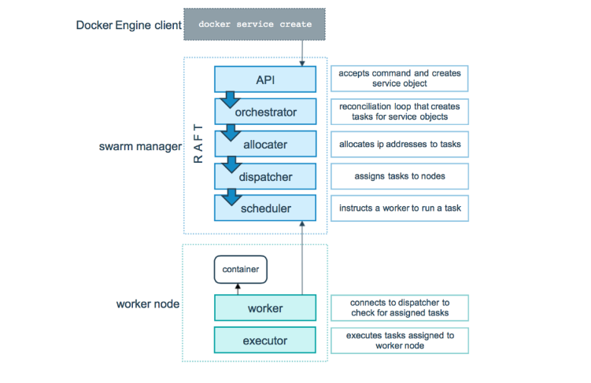

### Application Deployments
----------------------------

### Terms

* Capex: Captial Expenditure
* Opex: Operational Expenditure
* Physical Server
* Hypervisor
* Virtual Machine
* Return on Investment (ROI)

### Evolution

* Generation 1: Directly run on Physical Servers
    * Directly run on physical servers
    * If your application is not utilizing hardware completely, ROI is very long.


* Generation 2: Hypervisors create virtual machines and applications installed in virtual machines.
    * Hypervisors perform hardware virtualization and provide
        * virtual cpu
        * virtual ram
        * virtual disk
        * virtual network
    * In the isolated area created by hypervisor, we can install os and necessary softwares
    * Application can be installed and used from here
    * Better ROI.

* Generation 3: Containers: These are isolated areas which look like vms but the container is an isolated area which has virtualized os.
* Applications running in Containers will not feel the difference
* We can run more applications on a single box.


### What is Docker ?

* Docker (dock worker) is used to create containers which is standard way of packaging any application
* Application can be any of the below but have a standard way of packaging i.e docker image.
    * developed in any technology
    * developed on any server
* Packaging in docker image format helps us to run our application 

### Expectations from you in terms of Docker

* Containerize any application run by your organization.
* Manage Data, Security and Networks for containerized applications.
* To acheive the above expectations, we need to use
    * docker and understand how it runs and creates containers
    * play with docker aroud networks, data and security
    * apply them to our application.
### Run apache server (VM)
* Create a vm (ubuntu) and ssh into it
```
sudo apt update
sudo apt install apache2 -y
```
* Now navigate to ```http://<publicip>```


* Now lets try to also install nginx.

### Docker Installation

* When we install docker we get two major components
    * docker client
        * A command line to interact with docker engine.
    * docker engine: This is collection of multiple components
        * Orchestration
        * Docker daemon
        * Runtime

* To play the docker commands
    * manual --help
    * docker cheatsheet.
* Install
    * Linux VM:
        * Docker can be installed by following instructions over here [Refer Here](https://docs.docker.com/engine/install/)
        * Script based installtion [Refer Here](https://get.docker.com/)
        ``` 
        curl -fsSL https://get.docker.com -o get-docker.sh
        sh get-docker.sh
        ```
        
        * Docker allows communication to the unix socket for the users who belong to docker group. so lets add current user to docker group ```sudo usermod -aG docker <username>```. logout and login
        * Now execute ```docker container run hello-world```
        

### Docker Playground
* Create a Docker Hub account [Refer Here](https://hub.docker.com/)
* This playground gives a linux machine with docker installed for 4 hours for free. [Refer Here](https://labs.play-with-docker.com/)

#### Terms to be aware of
* containerd
* runc
* libcontainer
* oci
* docker shim
* appc
* grpc
* rkt containers

### Cheatsheets
* [Refer Here](https://docs.docker.com/get-started/docker_cheatsheet.pdf)
* [Refer Here](https://dockerlabs.collabnix.com/docker/cheatsheet/)


* Applications bring revenue to enterprises and to run applications we need servers, os etc

### Lets create a linux server and install tomcat in it

* Create a linux server (AWS/Azure/GCP)

* We have experimented in the linux vm
    * network interface gives network connectivity
    * cpu, ram and disk are available
    * to install softwares we have used package manager apt
* Commands
```
sudo apt update
sudo apt install net-tools openjdk-11-jdk tomcat9 -y
# to check network
ifconfig
# to check java
java -version
# to check tomcat
sudo systemctl status tomcat9
```
* We were able to exactly the similar operations inside container as well.

### Let me take an application

* This is spring pet clinic application
* Lets try to run this application on linux
[Refer Here](https://github.com/spring-projects/spring-petclinic)
* To build the code
```
sudo apt update
sudo apt install openjdk-17-jdk maven -y
git clone https://github.com/spring-projects/spring-petclinic.git
cd spring-petclinic
# java package
mvn package
java -jar target/spring-petclinic-3.0.0-SNAPSHOT.jar
```
* Docker way of working
    * We create a docker image (docker packaging format)
        * We need to create Dockerfile
        * push the image to registry (docker hub)
        * create the container using the image anywhere
* Dockerfile
```
FROM amazoncorretto:17-alpine-jdk
LABEL author=krishna
ADD target/spring-petclinic-3.0.0-SNAPSHOT.jar /springpetclinic.jar
EXPOSE 8080
CMD ["java", "-jar", "/springpetclinic.jar"]
```
* Create docker image
``` docker image build -t spc:1.0 .```
* To create a container 
```
docker conrainer run -d -P spc:1.0
docker conrainer run -d -P spc:1.0
docker conrainer run -d -P spc:1.0
```

### How Isolations are created or How Containers Work
* Each container is getting a
    * new process tree
    * disk mounts
    * network (nic)
    * cpu/memory
    * users
* Navigate to docker internals section notes and try to understand the things.


### Docker Architecture

#### Generation-1
* This was first gen, Where docker daemon used lxc (a linux kernel feature) to create containers


#### Generation-2
* Since docker was relying on lxc which was kernel feature, updates to kernel frequently used to break containers created by docker.
* So docker has created its own component called libcontainer (libc) to create containers.
* Docker wanted containers to be multi os and lxc was definetly not the way forward.

* Adoption of docker was drastically increased as it was stable.
### Generation 3:
* In this generation, docker engine was revamped from monolith to multi component architecture and the images and containers were according to OCI (open container initiative) image spec and runtime spec.
* In the latest architecture
* docker daemon exposes api’s to listen requests from docker client.
* Passes the requests to containerd. This manages the lifecylcle of container
* containerd forks a runc process which creates container. once the container is created the parent of the container will be docker shim.


### Creating our first docker container
* docker container creation:
* To create container we need some image in this case lets take ```hello-world```
* The command ```docker container run hello-world``` executed
* What happens
    * docker client will forward the request to docker daemon
    * docker daemon will check if the image exists locally. if yes creates the container by using image
    * if the image doesnot exist, then docker daemon tries to download the image from docker registry connected. The default docker registry is docker hub.
    * Downloading image into local repo from registy is called as pull.
    * Once the image is pulled the container is created.
    
* Registry is collection of docker images hosted for reuse.
* Docker hub [Refer Here](https://hub.docker.com/search?q=)

#### Playing with containers 
* Create a new linux vm and install docker in it

#### Check docker images in the host


### pull the images from docker hub
* image naming convention
```
[username]/[repository]:[<tag>]
madasu/myspc:1.0.1
username => madasu
repository => what image => myspc
tag => version => 1.0.1
```
* default tag is latest
```
nginx
nginx:latest
```
* official images dont have username
```
nginx
ubuntu
alpine
madasu/myspc
```
* Lets pull the image nginx with tag 1.23
```
docker image pull nginx:1.23
docker image ls
```

* Lets pull the jenkins image with latest version

* Lets find the alpine and pull the image


#### Remove images from local
* Every image will have unique image id and image name
* We can delete individually docker image rm alpine:3.17
* if i have to delete all the images ```docker image rm $(docker image ls -q)```


#### Create a container with nginx
* To create and start the container we use run command

* every container gets an id and a name. name can be passed while creating container, if not docker will give random name

* Remove all the running containers ```docker container rm -f $(docker container ls -q )```


* Remove specific container

* Remove all containers ```docker container rm -f $(docker container ls -a -q )```


### Docker container lifecycle
* Docker lifecycle states
    * Created
    * Running
    * Paused
    * Stopped
    * Deleted

* Accessing the applications inside docker containers
* From now the machine where we have installed docker will referred as host and the docker container will be referred as container
* We have access to host network & as of now containers are created in private container network, so to access applications inside containers we use port-forwording

* command: ```docker container run -d -p <host-port>:<container-port> <image>```
* Create a nginx container and expose on port 30000 ```docker container run -d -p 30000:80 --name nginx1 nginx```

* Create a jenkins container & expose 8080 port on 30001 port of host ```docker container run -d -p 30001:8080 --name jenkins1 jenkins/jenkins```

* To assing any random free port on host to container port ```docker container run -d -P image```
* Lets create 3 nginx containers


#### Containerizing spring petclinic
* I have spring petclinic version 2.4.2 which requires java 11 and runs on port 8080
* to start application java -jar spring-petclinic-2.4.2.jar
* What is required:
    * jdk 11
    * jar file
* How to access application
* http over port 8080
* Lets start the amazoncorretoo based container with port 8080 exposed [Refer Here](https://hub.docker.com/_/amazoncorretto)
```
docker container run -it -p 30000:8080 amazoncorretto:11 /bin/bash
```

* now lets download the spring petclinic [Refer Here](https://referenceapplicationskhaja.s3.us-west-2.amazonaws.com/spring-petclinic-2.4.2.jar)
```
curl https://referenceapplicationskhaja.s3.us-west-2.amazonaws.com/spring-petclinic-2.4.2.jar -o spring-petclinic-2.4.2.jar
ls
```
* Run the application ```java -jar spring-petclinic-2.4.2.jar```

*  Now to create a image from a running container, lets login into linux vm, so lets use ```docker container commit```

* remove all the containers and run the myspc image based container
```
docker container run -d -p 30001:8080 --name spc1 myspc:latest java -jar spring-petclinic-2.4.2.jar
```
* This is not a useful approach as we are creating images manually
* Docker has a better way i.e. ```Dockerfile```

### Dockerfile based Image building
* Workflow

* Dockerfile is a text file with instructions [Refer Here](https://docs.docker.com/engine/reference/builder/)
* The basic syntax ```INSTRUCTION arguments```
* In Docker we have concept of base image i.e. to run your application using some existing image
* We can use a base image called as scratch which has nothing in it
* In majority of the cases we take what is required to run our application as base image.

### Basic Instructions
* FROM: [Refer Here](https://docs.docker.com/engine/reference/builder/#from) for official docs. use tag all the time (donot use latest)
* RUN: The commands to be executed while building the image to install/configure your appliation [Refer Here](https://docs.docker.com/engine/reference/builder/#run)
* CMD: This command will be executed while starting the container. [Refer Here](https://docs.docker.com/engine/reference/builder/#cmd) for official docs
* EXPOSE: This adds ports to be exposed while starting the container [Refer Here](https://docs.docker.com/engine/reference/builder/#expose) for official docs


### Springpetclinic Dockerfile
* Lets do two ways
    * use any image with java11 already as base image ```amazoncorretto:11```
    * use any image with slim os as base image  ```alpine:3```
* Dockerfile based on amazoncorreto:11
```Dockerfile
FROM amazoncorretto:11
RUN curl https://referenceapplicationskhaja.s3.us-west-2.amazonaws.com/spring-petclinic-2.4.2.jar -o spring-petclinic-2.4.2.jar
EXPOSE 8080
CMD ["java", "-jar", "spring-petclinic-2.4.2.jar"]
```
* Lets build the image based on amazoncorreto


* Now lets create a container ```docker container run -d -P --name spc1 myspc:corretto11```


* Approach 2: Start from some os
```Dockerfile
FROM alpine:3
RUN apk add openjdk11
RUN wget https://referenceapplicationskhaja.s3.us-west-2.amazonaws.com/spring-petclinic-2.4.2.jar
EXPOSE 8080
CMD ["java", "-jar", "spring-petclinic-2.4.2.jar"]
```
* Build the image


* Lets run the container ```docker container run -d -P --name myspc2 myspc:alpine```


### Immutable Infrastructure
* Any infra changes will not be done on infra directly rather we create some infra as code option and change the configuration.

* LABEL: This instruction adds metadata [Refere Here](https://docs.docker.com/engine/reference/builder/#label)
    ```Dockerfile
    FROM amazoncorretto:11
    LABEL author="krishnaprasad"
    LABEL organization="invenger"
    LABEL project="learning"
    RUN curl https://referenceapplicationskhaja.s3.us-west-2.amazonaws.com/spring-petclinic-2.4.2.jar -o spring-petclinic-2.4.2.jar
    EXPOSE 8080
* Lets inspect the image docker image inspect spc:1.0.0.1 and observe the labels section


### ADD, COPY instructions
* ADD instruction can add the files into docker image from local file system as well as from http(s)
* ADD instruction can have sources
    * local file system
    * git repo
    * url
* COPY supports only local file system
* Lets use ADD to download springpetclinic into docker image from url ADD https://referenceapplicationskhaja.s3.us-west-2.amazonaws.com/spring-petclinic-2.4.2.jar /spring-petclinic-2.4.2.jar


```Dockerfile
FROM amazoncorretto:11
LABEL author="krishnaprasad"
LABEL organization="invenger"
LABEL project="learning"
ADD https://referenceapplicationskhaja.s3.us-west-2.amazonaws.com/spring-petclinic-2.4.2.jar  /spring-petclinic-2.4.2.jar
EXPOSE 8080
CMD ["java", "-jar", "/spring-petclinic-2.4.2.jar"]
```
* copy the springpetclinic jar file into some local path on docker host. 

```Dockerfile
FROM amazoncorretto:11
LABEL author="krishnaprasad"
LABEL organization="invenger"
LABEL project="learning"
# Copy from local file on Docker host into docker image
COPY spring-petclinic-2.4.2.jar  /spring-petclinic-2.4.2.jar
EXPOSE 8080
CMD ["java", "-jar", "/spring-petclinic-2.4.2.jar"]
```
### What do we mean by running container in detached mode?
* Lets try to start the docker container jenkins ```jenkins/jenkins```


* docker container’s STDOUT and STDERR will be attached to your terminal and if we execute ctrl+c the container exits.
* Running container normally will take us to attached mode.
* In detached mode container executes and gives us back the access to terminal

* Once we start the container in detached mode we can still view the STDOUT and STDERR by executing ```docker container attach <container-name-or-id>```
To exit from attach mode Ctrl+PQ

### Docker container will be in running state as long as command in cmd is running
* Consider the following Dockerfile
```Dockerfile
FROM amazoncorretto:11
LABEL author="krishnaprasad"
LABEL organization="invenger"
LABEL project="learning"
# Copy from local file on Docker host into docker image
COPY spring-petclinic-2.4.2.jar  /spring-petclinic-2.4.2.jar
EXPOSE 8080
CMD ["sleep", "10s"]
```
* We have sleep 10s i.e. this will run for 10s and finish.
* Docker container will move to exited stated once the command in CMD has finished executing


### Setting Environment Variables in the container
* ENV instruction [Refer Here](https://docs.docker.com/engine/reference/builder/#env)
* This instruction adds environmental variable in the container and it also allows us to change environmental variables while creating containers.
* docker container exec will allow us to execute commands in the container
* ```docker container exec spc printenv``` it will print the environmental variables in the spc container.
* ```docker container exec -it <c-name> <shell>``` will allow us to login into container

* ARG instruction allows us to set the values while building the image [Refer Here](https://docs.docker.com/engine/reference/builder/#arg)
```Dockerfile
FROM mcr.microsoft.com/dotnet/sdk:7.0
LABEL author="krishna" organization="invenger" project="learning"
ARG DOWNLOAD_URL=https://github.com/nopSolutions/nopCommerce/releases/download/release-4.60.2/nopCommerce_4.60.2_NoSource_linux_x64.zip
ARG HOME_DIR=/nop
ADD ${DOWNLOAD_URL} ${HOME_DIR}/nopCommerce_4.60.2_NoSource_linux_x64.zip
WORKDIR ${HOME_DIR}
RUN apt update && apt install unzip -y && \
    unzip ${HOME_DIR}/nopCommerce_4.60.2_NoSource_linux_x64.zip && \
    mkdir ${HOME_DIR}/bin && mkdir ${HOME_DIR}/logs
EXPOSE 5000
ENV ASPNETCORE_URLS="http://0.0.0.0:5000"
CMD [ "dotnet", "Nop.Web.dll"]
```
* Refer above Dockerfile there i have added Build arguments.
* Build args can be set while creating images. BUILD ARG can be used by using ```${ARG_NAME}```


* USER: [Refer Here](https://docs.docker.com/engine/reference/builder/#user)
```Dockerfile
FROM mcr.microsoft.com/dotnet/sdk:7.0
LABEL author="krishna" organization="invenger" project="learning"
ARG user=nopcommerce
ARG group=nopcommerce
ARG uid=1000
ARG gid=1000
ARG DOWNLOAD_URL=https://github.com/nopSolutions/nopCommerce/releases/download/release-4.60.2/nopCommerce_4.60.2_NoSource_linux_x64.zip
ARG HOME_DIR=/nop
RUN apt update && apt install unzip -y
# Create user nopcommerce
RUN groupadd -g ${gid} ${group} \
    && useradd -d "$HOME_DIR" -u ${uid} -g ${gid} -m -s /bin/bash ${user}
USER ${user}
WORKDIR ${HOME_DIR}
ADD --chown=${user}:${group} ${DOWNLOAD_URL} ${HOME_DIR}/nopCommerce_4.60.2_NoSource_linux_x64.zip
RUN unzip ${HOME_DIR}/nopCommerce_4.60.2_NoSource_linux_x64.zip && \
    mkdir ${HOME_DIR}/bin && mkdir ${HOME_DIR}/logs
EXPOSE 5000
ENV ASPNETCORE_URLS="http://0.0.0.0:5000"
CMD [ "dotnet", "Nop.Web.dll"]
```

* Refer Here for the changes done to add a non root user to run the nop commerce application.


### Image Layers
* A Read write layer gets added to every container and image will have read layers
### Layers in Docker Image
* Lets pull alpine image and inspect the image
```
docker image pull alpine
docker image inspect alpine
```


### Experiment 1
* Lets create a new image based on alpine exp1
```
FROM alpine
label author=krishna
CMD ["sleep", "1d"]
```
* List images

* inspect layers of alpine and exp1


### Experiment 2
* Lets create a new image based on alpine exp2
```
FROM alpine
label author=krishna
ADD 1.txt /
CMD ["sleep", "1d"]
```

* lets inspect layers of exp2 and alpine


### Experiment 3
* Lets create a new image based on alpine exp3
```
FROM alpine
label author=krishna
RUN echo "one" > 1.txt
RUN echo "two" > 2.txt
RUN echo "three" > 3.txt
CMD ["sleep", "1d"]
```
* Inspect image layers


### Experimenet 4
* Lets create a new image based on alpine exp4
```
FROM alpine
label author=krishna
RUN echo "one" > 1.txt && \
    echo "two" > 2.txt && \
    echo "three" > 3.txt
CMD ["sleep", "1d"]
```
* inspect results


### Layers in Docker image
* Docker image is collection of layers and some metadata
* Docker image gets first set of layers from base image
* Any Additional changes w.r.t ADD/COPY creates extra layers
* Each RUN instruction which needs some storage creates layer
* It is recommended to use Multiple commands in RUN instruction rather than multiple RUN instructions as this leads to too many layers
* Docker has a filesystem which is aware of layers
    * overlay2

### Container and layers
* When a container gets created all the effective read-only image layers are mounted as disk to the container
* Docker creates a thin read write layer for each container.
* Any changes made by container will be stored in this layer
* Problem: when we delete container read write layer will be deleted.

### Stateful Appplications and Stateless Applications
* Stateful applications use local storage to store any state
* Stateless applications use external systems (database, blobstorage etc) to store the state
* We need not do anything special if your application is stateless in terms of writable layer, but if it stateful we need to preserve the state.

### Solving the Problem with Writable Layers
* Lets create a mysql container [Refere Here](https://hub.docker.com/_/mysql)
* Command
```
docker container run -d --name mysqldb -e MYSQL_ROOT_PASSWORD=krishna -e MYSQL_DATABASE=employees -e MYSQL_USER=krishna -e MYSQL_PASSWORD=krishna -P mysql:8
```
* To login into container
```
docker container exec -it mysqldb mysql --password=krishna
```
* To create a table
```
use employees;
CREATE TABLE Persons (
    PersonID int,
    LastName varchar(255),
    FirstName varchar(255),
    Address varchar(255),
    City varchar(255)
);
Insert into Persons Values (1,'test','test', 'test', 'test');
Select * from Persons;
```

* Now if we remove the container we loose the data
* To fix the problem with data losses, Docker has volumes.
* Volume can exist even after docker container is deleted.
* We can attach volumes to other containers as well
* For this volume to work, we need to know the folder of which data will be preserved
* Let explore docker volume subcommand

* docker volume creates a storage according to the driver specified. The default driver is local i.e. the volume is created in the machine where docker is executing

### Docker volumes 
[Refer Here](https://docs.docker.com/storage/volumes/#:~:text=Volumes%20are%20the%20preferred%20mechanism,are%20completely%20managed%20by%20Docker.)

### Key Points
1. Always ensure volumes are automatically created for the stateful applications as part of Dockerfile (VOLUME instruction)
2. Volumes are of two types
    1. Explicity created (docker volume create myvol)
    2. automatically created as part of container creation
3. Ensure we have knowledge on necessary folders where the data is stored and use volumes for it


### Multi Stage Docker build
* Multi staged build is used to build the code and copy necessary files into the final stage which will be your image


* [Refer Here](https://docs.docker.com/build/building/multi-stage/) for official docs.

### Scenario – 1: Java Spring petclinic
* To build this application we need
    * jdk17
    * maven
    * git
* Manual steps:
```
git clone https://github.com/spring-projects/spring-petclinic.git
cd spring-petclinic 
mvn package
# a file gets created in target/spring-petclinic-*.jar
```
* To run this application we need jdk 17
* Refer below Dockerfile to create spring petclinic as multistage build
```Dockerfile
FROM alpine/git AS vcs
RUN cd / && git clone https://github.com/spring-projects/spring-petclinic.git && \
    pwd && ls /spring-petclinic

FROM maven:3-amazoncorretto-17 AS builder
COPY --from=vcs /spring-petclinic /spring-petclinic
RUN ls /spring-petclinic 
RUN cd /spring-petclinic && mvn package


FROM amazoncorretto:17-alpine-jdk
LABEL author="krishna"
EXPOSE 8080
ARG HOME_DIR=/spc
WORKDIR ${HOME_DIR}
COPY --from=builder /spring-petclinic/target/spring-*.jar ${HOME_DIR}/spring-petclinic.jar
EXPOSE 8080
CMD ["java", "-jar", "spring-petclinic.jar"]
```

### Pushing images to Registries

### Docker Hub
* Public Registry: Docker Hub [Refer Here](https://hub.docker.com/)
* Create a public Repository
* Repository will be in the form of ```<username>/<repo-name>:<tag>```

* After building the image tag the image to new naming format
```
docker image tag spc:1.0 madasu/spc:1.0
```


* if this image has to be default also tag with latest (optional)
* login into docker hub from cli
```
docker login
```


* Lets push the images


### Private Registries
* There are many applciations for hosting private registries
* AWS: ECR (Elastic container registry)
* Azure: ACR (Azure Container Registry)
* Jfrog

### Understanding Multi-Host Networking

* Multi-host networking is created as part of docker orchestration called as ```SWARM```
* [Refer Here](https://github.com/krishna5683akp/Invenger_Docker_Notes/blob/main/Docker_Network.md) [Refer Here](https://github.com/krishna5683akp/Invenger_Docker_Notes/blob/main/Docker_Networking2.md) for multi host networking.

##  Docker SWARM Mode

### Docker Swarm

* The cluster maanagement & Orchestration features are embedded inside Docker Engine.
* Docker swarm consists of multiple docker hosts which run in swarm mode.
* Two Roles **managers** and **workers** exist in Docker swarm
* **Manager** is responsible for membership & delegation
* **Worker** is responsible for running swarm services
* Each Docker Host can be a manager, a worker or both.
* In Docker Swarm **Desired State** is maintained. For instance if you are running one container in swarm on a particular node (Worker) and that node goes down, then Swarm schedules this nodes task on other node to maintain the state.
* **Task** is a running container which is part of swarm service managed by Swarm Manager

### Nodes

* It is instance of the docker engine participating in Swarm.
* There are two kinds of nodes
* Manager nodes:
    * You communicate to manager node to deploy applications in the form of Service Definitions.
    * Manager nodes dispatch unit of work called as tasks to the Worker ndoes.
* Worker nodes:
    * They receive & execute the tasks dispatched from manager nodes.
    * An agent runs on the worker node & reports on the tasks assigned to it

### Services and Tasks

* Service is the definition of the task to be executed.
* Typically it would be the application to be deployed.
* Two kinds of Service models are available
    * **Replicated Services model**: In this case swarm manager distributes a specific number of replica task among the nodes based upon the scale you set in the desired state
    * **Global Services Model**: In this case swarm runs one task for the service on every available node in the cluster.

### Task

* carries a Docker container and the commands to run inside the container.
* It is the atomic secheduling unit of swarm.
* Once a task is assigned to node, it cannot move to another node.
* It can only run on the assigned node or fail.

### Swarm Setup

* In this series, I would be using 3 ubuntu 20 machines.
* One would be manager & other two would be workers.
* Login into ssh session of the machie which would be manager.
* Ensure all the machines can be communicated (or pingable from manager)
* Make a note of private ip address of the manager (In this example the managers ip address would be 172.31.42.125) and then exec
```
docker swarm init --advertise-addr <Manager-ip>

# In my case this is
docker swarm init --advertise-addr 172.31.42.125

##Outpu###
Swarm initialized: current node (uyclb1gbhhqhlo80aq7zhx2z4) is now a manager.

To add a worker to this swarm, run the following command:

    docker swarm join --token SWMTKN-1-1w51ouq6zrmts85l71z53ruqcc1pivzprpigdodspu58o7dp3z-172clbo51xq8w7uwizm8cc19t 172.31.42.125:2377

To add a manager to this swarm, run 'docker swarm join-token manager' and follow the instructions.
```
* Execute ```docker info``` on the manager and observe the output should consists of Swarm: active and other info about Docker Swarm.
* Execute command   ```docker node ls``` and you should see the status of the manager node
* Now login into other nodes and execute docker swarm join command which is output of the docker swarm init command as mentioned above.
```
docker swarm join --token SWMTKN-1-1w51ouq6zrmts85l71z53ruqcc1pivzprpigdodspu58o7dp3z-172clbo51xq8w7uwizm8cc19t 172.31.42.125:2377

##Output##
This node joined a swarm as a worker.
```
* Now ssh into the manager and execute docker node ls and you should be able to see three nodes information.
* Lets create a tomcat service by using the following command
```
docker service create --replicas 2 --name tomcat tomcat:8
```
* This command leads to creation of tasks and output would be like
```
tvdml6nt5dryszozaydr8sv8o

overall progress: 2 out of 2 tasks                                            
1/2: running   [==================================================>]

2/2: running   [==================================================>]
verify: Service converged 
```
* Execute docker service ls and the possible output would look like
```
ID                  NAME                MODE                REPLICAS            IMAGE               PORTS
tvdml6nt5dry        tomcat              replicated          2/2                 tomcat:8
```
* Lets inspect the service using ```docker service inspect --pretty tomcat``` and the output of the command would be
```
ID:             tvdml6nt5dryszozaydr8sv8o
Name:           tomcat
Service Mode:   Replicated
 Replicas:      2
Placement:
UpdateConfig:
 Parallelism:   1
 On failure:    pause
 Monitoring Period: 5s
 Max failure ratio: 0
 Update order:      stop-first
RollbackConfig:
 Parallelism:   1
 On failure:    pause
 Monitoring Period: 5s
 Max failure ratio: 0
 Rollback order:    stop-first
ContainerSpec:
 Image:         tomcat:8@sha256:bb4ceffaf5aa2eba6c3ee0db46d863c8b23b263cb547dec0942e757598fd0c24
 Init:          false
Resources:
Endpoint Mode:  vip
```
* Execute ```docker service ps tomcat``` command to findout on which node the tasks are executed.
* Lets scale the number of containers running tomcat by using the following command ```docker service scale tomcat=4``` and the output would be.
```
tomcat scaled to 4

overall progress: 4 out of 4 tasks                                                                             
1/4: running   [==================================================>]                                         
2/4: running   [==================================================>]                                           
3/4: running   [==================================================>]                                           
4/4: running   [==================================================>]                                           
verify: Service converged 
```
* Service can be deleted using the follwing command ```docker service rm tomcat```

### Rolling updates to docker swarm
* Execute the following command to deploy jenkins
```
docker service create --name jenkins --replicas 2 --update-delay 10s --publish published=8081,target=8080 jenkins:1.609.1
```
* Now navigate to ipaddress of any node and http://<nodip:8081
* Now lets try to update to the newer version of jenkins
```
docker service update --image jenkins:latest jenkins
```

### Relevance to Docker Networking

* Now execute this command docker network ls on the manager and you should see the output which would look like
```
NETWORK ID          NAME                DRIVER              SCOPE
4fa602b7a4ec        bridge              bridge              local
c3ba8230b575        docker_gwbridge     bridge              local
436956ab2dd0        host                host                local
m6zbhh5cn5ag        ingress             overlay             swarm
dfa793d07248        none                null                local
```
* In this overlay network driver is used and scope for that driver is swarm.
* So we can conclude that Docker swarm uses overlay and bridge (docker_gwbridge) to enable multiple Docker Host Communications.

### How Docker Swarm Works?

* Docker swarm uses **RAFT** Consensus Algorithm to maintain a consistent internal state of the entire swarm and all the services running on it.


### Manager Nodes

* Manager nodes handle cluster management tasks
    * cluster state management
    * service scheduling
    * serving Swarm mode
* To take advantage of swarm mode’s fault-tolerance features, Docker recommends you implement an odd number of nodes according to your organization’s high-availability requirements. When you have multiple managers you can recover from the failure of a manager node without downtime.
```
* A three-manager swarm tolerates a maximum loss of one manager.
* A five-manager swarm tolerates a maximum simultaneous loss of two manager nodes.
* An N manager cluster tolerates the loss of at most (N-1)/2 managers.
* Docker recommends a maximum of seven manager nodes for a swarm.
```

### Worker Nodes

* Instance of Docker Engine whose purpose is to execute containers
* They dont participate in Raft distributed state or any of the managers tasks.
* Worker Node can be made Manager node by using ```docker node promote```. note: This has to be executed by Manager Node

### Docker Service LifeCycle



### External Access For Docker Services

### Ingress Mode Service Publishing

```
docker service create --replicas 2 --publish mode=ingress,target=80,published=8080 nginx
```
* This mode publishes the exposed port on every Swarm node.
* Load balancing happens in this mode

### Host Mode Service Publishing
```
docker service create --replicas 2 --publish mode=host,target=80,published=8080 nginx
```
* In this mode the published port is exposed on the host where this service is running
* Load balancing doesn’t happen


* Communication between containers in same host is possible using bridge or macvlan etc. but communication between two containers running on two different hosts is not possible


* Docker has a netwok driver called as overlay network
* Using vxlan, overlay networks use underlay to create a virtual network which is logical and appears as if the containers across hosts are connected to the same network


* To create multi host network, we need to create docker swarm cluster.
* Swarm cluster provides native docker container orchestration.
* Some of the activities the cluster performs
    * Maintains the desired state.
    * Performs scaling
    * chooses the master node (manager)
    * ability to add docker hosts to the cluster


### Docker compose

* This was external tool, but now it is integrated as docker subcommand ```docker compose```
* Compose allows use to specify the yaml file which helps in creating the below by specifying in a yaml file
    * networks
    * volumes
    * containers
* docker compose file will have the name of ```docker-compose.yml```
* sample
```yaml
---
version: '3.9'
services:
  web:
    image: nginx:latest
    networks:
      - hello-net
    volumes:
      - type: volume
        source: my-vol
        target: /tools
networks:
  hello-net:
    driver: bridge
volumes:
  my-vol:
```
* to start all the containers create a folder copy the docker-compose.yaml and execute ```docker compose up -d``` and to remove every thing ```docker compose down```


```yaml
---
version: "3.9"
services:
  student-srv:
    build: 
      context: .
    networks:
      - students-net
      - students-private-net
    ports:
      - target: 8080
        published: 8080
        protocol: tcp
        mode: host
    environment:
      - MYSQL_SERVER=students-db
    depends_on:
      - students-db
  students-db:
    image: mysql:5.6
    networks:
      - students-private-net
    environment:
      - MYSQL_ROOT_PASSWORD=password
      - MYSQL_DATABASE=test
      - MYSQL_USER=krishna
      - MYSQL_PASSWORD=krishna
    volumes:
      - type: volume
        source: students-db
        target: /var/lib/mysql

volumes:
  students-db:

networks:
  students-net:
    driver: bridge
    ipam:
      config:
        - subnet: 192.168.101.0/24
  students-private-net:
    driver: bridge
    ipam:
      config:
        - subnet: 192.168.102.0/24
```
* Refer above sample compose file with instructions to run student course register. it is sample python application.
