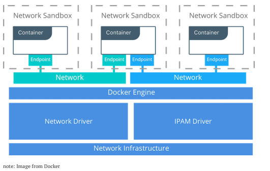
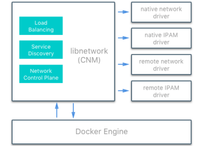
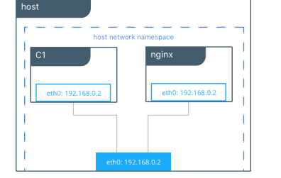
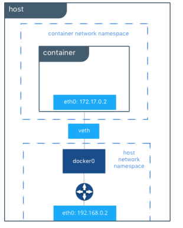
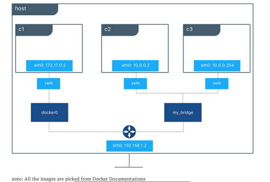

### Docker Networking Series-1

##### Linux Networking Fundamentals

* Docker networking uses the kernel’s networking stack to create high level networking feature of Docker
* **Docker Networking is Linux Networking**.
* Also refer OSI Networking Model [ReferHere](https://www.cloudflare.com/learning/ddos/glossary/open-systems-interconnection-model-osi/)

### Building Blocks

#### Linux Bridge

* This is layer 2 device with virtual implementation of physical switch inside Linux Kernel
* Forwards the traffic based on MAC address by inspecting traffic.

#### Network Namespace
* Isolated network stack in kernel with its own interfaces, routes & firewall rules

#### Virtual Ethernet Devices or veth
* Linux networking interface that acts as connecting wire between two two network namespaces

#### iptables
* Generic table structure that defines rules & commands as part of the netfilter framework.

### Docker Networking Architecture
* Docker Networking Architecture is based on Container Networking Model.

### CNM Constructs – Sandbox
* Contains the configuration of the containers network stack.
* Includes routing tables, container’s interfaces, DNS setting etc.
* Sample implementation could be Linux Network Namespace or any other similar concept.

### CNM Constructs – Endpoint
* Joins sandbox to the Network.
* This abstracts actual connection to the network away from application.
* Maintains portability for applications, so that they can use differen network drivers

### CNM Constructs – Network
* Collection of endpoints having connectivity b/w themselves

### CNM Constructs – Network
* Collection of endpoints having connectivity b/w themselves.

### CNM Driver Interfaces

* CNM provides two pluggable & open interfaces to leverage additional functionality and control in the network.
    * Network Drivers

        
    * IPAM Drivers.
### Docker Native Network Drivers
* Host
    * Container uses the networking stack of the host.
* Bridge
    * Creates a bridge on the host that is managed by Docker.
    * All containers on Bridge Driver can communicate among themselves
    * Default Driver
* Overlay
    * Used for multi-host networks.
    * Uses local linux bridges & VXLAN to overlay container-to-container networking
* MACVLAN
    * Uses Linux MACVLAN bridge to establish connection b/w container interfaces & parent host interfaces
    * MAC address can be attached to each container
* None

### Docker Networking Scopes
* Local: provides connectivity within host
* Swarm: provides connectivity across swarm cluster

### Tutorials
* [Bridge](https://docs.docker.com/network/network-tutorial-standalone/)
* [Host](https://docs.docker.com/network/network-tutorial-host/)
* [Overlay](https://docs.docker.com/network/network-tutorial-overlay/)

### Host Network Driver
* In host network driver all the containers are in same network namespace(sandbox)

### Bridge Network Driver
* Default Bridge Network Driver

    

### User-Defined Bridge Networks
