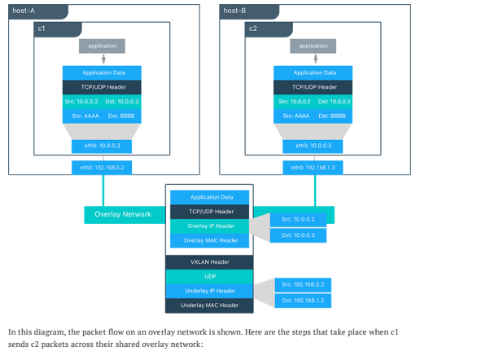
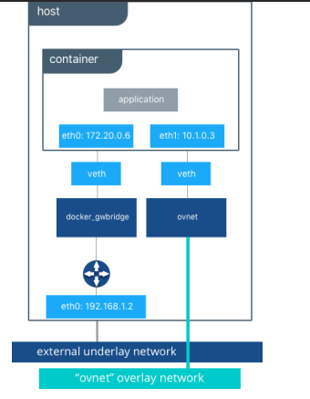

### Docker Networking Series -2

### Overlay Network Driver
* Docker Swarm uses overlay networking to communicate between multiple Docker Hosts.
* In this series lets try to understand concepts of the Docker Overlay Network Driver 

### How Packets flow through the Overlay Network Driver

* When you create overlay network as mentioned in the swarm series, two network drivers are create
    * Overlay: This points to the overlay network
    * docker_gwbridge: The egress bridge is for traffic leaving the cluster. only one     docker_gwbride exists per host. This bridge is used for ingress/egress communications
    not for container to container communications with in overlay.
* The underlying internal architecture look like this
