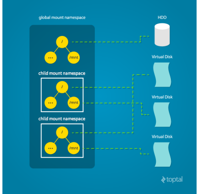

### Docker Internals

**Lets start from container**
* Container can be defined as isolation with some resource limits

* So, host system can create multiple different containers

### How are Isolations Created & Resource Limits Applied ?
* Isolations on the linux machines are created using a linux kernel feature called Namespaces. for more info [click here](https://en.wikipedia.org/wiki/Linux_namespaces)
* Resource Limits are applied using kernel feature called as cgroups (Control groups). For more info [click here](https://en.wikipedia.org/wiki/Cgroups)

* Working on namespaces & cgroups are difficult, but here comes the docker to the rescue.
* Docker Engine makes it easy to create isolated areas & resource limits

### Namespaces 
* Namespace is a linux feature
* There is an intresting article on namespaces over [here](https://www.toptal.com/linux/separation-anxiety-isolating-your-system-with-linux-namespaces)
#### can skip code & look at images
* To be very specific,
    * pID namespace(Process Namespace) creates the isolatesd process tree inside the container
    
* Note this is link to image from this [article](https://www.toptal.com/linux/separation-anxiety-isolating-your-system-with-linux-namespaces)
    * net namespace (Network Namespace) creates the isolated networking for each container with its own network interface.
    
*  Note this is link to image from this [article](https://www.toptal.com/linux/separation-anxiety-isolating-your-system-with-linux-namespaces)
    * mount namespace creation allows each container to have a different view of entire systems mount point, this allows containers to have their own file system view which starts from root.
    
    * user namespace allows to create whole new set of user & groups for the containers
* Fortunately even in windows world we have namespaces now. The purpose of the namespace is same but underlying implementation differs. Refer this [article](https://learn.microsoft.com/en-us/archive/msdn-magazine/2017/april/containers-bringing-docker-to-windows-developers-with-windows-server-containers)
* cgroups (control groups)
    * cgroups is a linux kernel feature
    * Control groups is used to impose limits. We can impose limits of disk io, RAM & cpu’s using ControlGroups
    * Fortunately even in windows world we have control groups now. The purpose of the namespace is same but underlying implementation differs. Refer this [article](https://learn.microsoft.com/en-us/archive/msdn-magazine/2017/april/containers-bringing-docker-to-windows-developers-with-windows-server-containers)

* Containers also have Layers for Filesystems.

**will be discussed in another article very soon**.

**Docker Underlying Components**
* The underlying components of docker as per the latest implimentation is looking as shown 

* The Specific Linux Implementation will be shown below

* The Specific Windows Implementation will be as shown below
