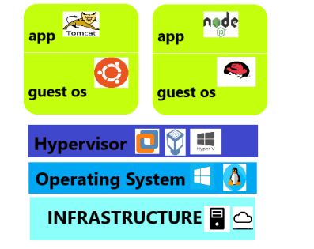
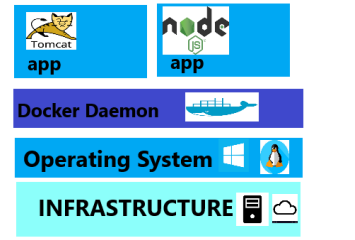

### Understanding what is docker?

* To understand docker, it is essential that we understand what a container is, So lets try to understand what is a container. To make this process simple by considering an application deployment in Virtual Machines and Docker Platform
* I would be taking an example of need for deploying two applications
    * runs on tomcat
    * runs on node js

##### Virtual Machine

* Lets Understand how virtual machines can achieve the above mentioned application deployments.

* First we need to have a physical/cloud based infrastructure, on top of it we would be installing the host operating system, then we would install hypervisors like Vmware, Virtual Box, Hyper-V etc.
* Then we would create two different virtual machines. In each virtual machine we would
    * install operating system
    * install necessary softwares
    * allocate memory etc

##### Docker
* Lets Understand how docker containers can achieve the above mentioned application deployments

* First we need to have a physical/cloud based infrastructure, on top of it we would be installing the host operating system, then we would install docker.
* Docker will create two different isolated areas on your OS where we can run our applications. By the way this isolated area is called as Container
* Unlike Virtual Machine, there is no need to install host os , we can directly deploy our applications.
* Your applications will still be isolated, as they get the different virtual ip address, different memory spaces etc
* Important Docker is used to isolate individual applications not entire systems, whereas to isolate entire system we would go for hypervisors & create Virtual Machines